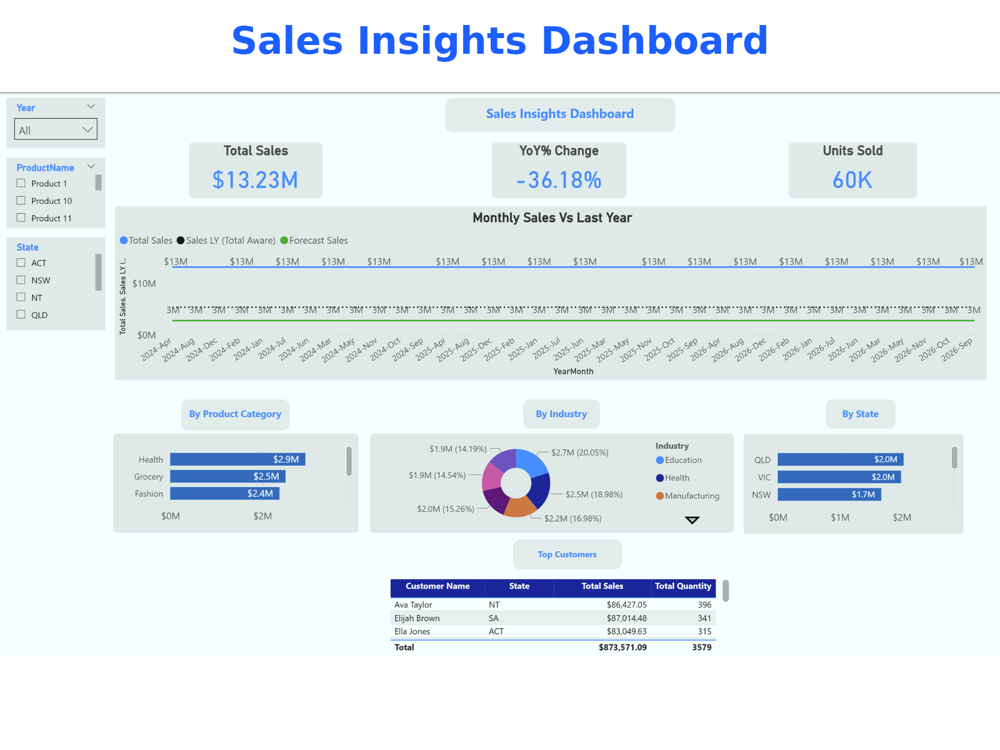

## 🧹 CleanStart: Lightweight Data Cleaning + Power BI Dashboard Toolkit

**CleanStart** is a streamlined, ready-to-deploy data cleaning and reporting toolkit built for small and medium businesses (SMBs), startups, and analysts who work with messy spreadsheets.

It automates the essential cleaning steps and produces a clean, visual summary using Power BI — allowing clients to go from raw `.csv` to decision-ready dashboards in just a few steps.

---

## ✅ Features Included in the Starter Tier

✔ Remove duplicate rows  
✔ Trim whitespace  
✔ Handle NULLs and blanks  
✔ Remove invalid/special characters  
✔ Filter invalid values (e.g., Age < 0)  
✔ Standardize formats (e.g., phone numbers, dates, amounts)  

🔁 Outputs:
- Cleaned `.csv` or `.xlsx` file
- A simple Power BI dashboard (up to 5 visuals)

---

## 🖼️ Sample Outputs

| Raw Spreadsheet | Cleaned Output |
|------------------|----------------|
|  |  |

---

## 📊 Example Dashboards

**Sales Insights:**

**Cashflow Report:**

---

## 📁 Sample Files

- `sample_input/sample_customers_dirty.csv` – raw messy spreadsheet  
- `sample_output/cleaned_customers_output.csv` – cleaned version

---

## 💬 Interested in Using This?

This repository is for **demo and showcase only**.

For:
- Client-specific automation
- Deployment in your environment
- Advanced dashboards
- Private installations

➡️ Visit my Upwork profile and hire me via [CleanStart Project Catalog](https://www.upwork.com/services/product/development-it-cleaned-data-from-messy-spreadsheets-a-power-bi-dashboard-1957436694365644557)

---

## 🔒 Privacy & Security

- Your data is **never stored or reused**.
- All client deliverables are handled via **private Git repos or secure file delivery**.
- Full transparency. NDA available upon request.

---

© 2025 — CleanStart by R John